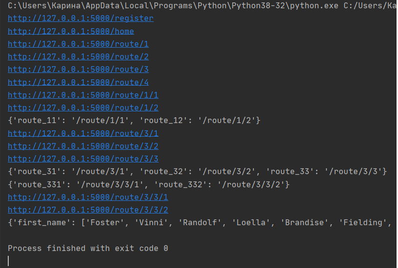

# Network-Programming
## Laboratory Work 1

#### Launch
$ python main.py

#### Requirements 
python 3.8.2 and higher 

#### Implementation 
For different functionalities of the lab are created separated classes like 
client.py, server.py, format.py, save.py, traverse.py

#### Task done
- [x] access the root route of the server  
- [x] get links to next links from link key
- [x] parse and save the data to general representation like
```
  {'first_name': ['Foster', 'Vinni', 'Randolf', 'Loella', 'Brandise', 'Fielding]}
```
- [ ] a concurrent TCP server (still in progress)



